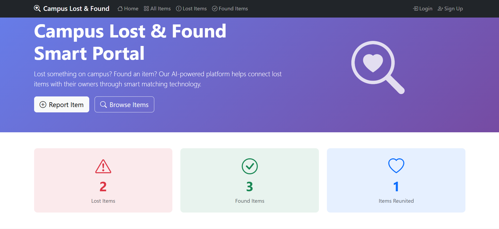

# 🔍 Campus Lost & Found Smart Portal

A comprehensive web application designed to help university students and staff report, track, and recover lost items on campus. Built with Django and powered by AI-based matching algorithms.


## 📋 Table of Contents

- [Features](#-features)
- [Tech Stack](#-tech-stack)
- [Installation](#-installation)
- [Usage](#-usage)
- [Project Structure](#-project-structure)
- [Screenshots](#-screenshots)
- [Contributing](#-contributing)
- [License](#-license)

## ✨ Features

### Core Features
- **Report Lost Items** - Users can report items they've lost with detailed descriptions
- **Report Found Items** - Users can report items they've found on campus
- **AI-Powered Matching** - Intelligent matching system using TF-IDF and Cosine Similarity to suggest potential matches between lost and found items
- **Category-Based Search** - Filter items by categories (Electronics, Documents, Accessories, Clothing, Books, Keys, Wallet, Bags, etc.)
- **Image Upload** - Upload images of lost/found items for better identification

### User Management
- **User Registration & Authentication** - Secure signup and login system
- **User Dashboard** - Personal dashboard to manage your reported items
- **My Items** - View and manage items you've posted

### Search & Discovery
- **Advanced Search** - Search items by title, description, location, and category
- **Browse All Items** - View all lost and found items in the system
- **Item Details** - Detailed view of each item with all information

## 🛠 Tech Stack

| Technology | Purpose |
|------------|---------|
| **Django 5.1+** | Backend web framework |
| **Python 3.10+** | Programming language |
| **SQLite** | Database |
| **scikit-learn** | AI/ML for item matching |
| **Pillow** | Image processing |
| **Bootstrap 5** | Frontend styling |
| **django-crispy-forms** | Form rendering |

## 🚀 Installation

### Prerequisites
- Python 3.10 or higher
- pip (Python package manager)
- Git

### Step-by-Step Setup

1. **Clone the repository**
   ```bash
   git clone https://github.com/yawar2518/campus-lost-and-found.git
   cd campus-lost-and-found
   ```

2. **Create a virtual environment**
   ```bash
   python -m venv venv
   
   # Windows
   venv\Scripts\activate
   
   # macOS/Linux
   source venv/bin/activate
   ```

3. **Install dependencies**
   ```bash
   pip install -r requirements.txt
   ```

4. **Navigate to the project directory**
   ```bash
   cd campusLostAndFound
   ```

5. **Run database migrations**
   ```bash
   python manage.py migrate
   ```

6. **Create a superuser (optional)**
   ```bash
   python manage.py createsuperuser
   ```

7. **Run the development server**
   ```bash
   python manage.py runserver
   ```

8. **Open your browser**
   ```
   http://127.0.0.1:8000/
   ```

## 📖 Usage

### Reporting a Lost Item
1. Register/Login to your account
2. Click on "Report Lost Item"
3. Fill in the item details (title, description, category, location, date)
4. Upload an image (optional)
5. Submit the form

### Reporting a Found Item
1. Register/Login to your account
2. Click on "Report Found Item"
3. Fill in the item details
4. Upload an image (optional)
5. Submit the form

### Finding Matches
- The AI system automatically suggests potential matches
- View suggested matches on the item detail page
- Contact the owner if you find a match

## 📁 Project Structure

```
campusLostAndFound/
├── campusLostAndFound/          # Main Django project settings
│   ├── settings.py              # Project configuration
│   ├── urls.py                  # Main URL routing
│   └── wsgi.py                  # WSGI configuration
├── items/                       # Main application
│   ├── models.py                # Database models (Item)
│   ├── views.py                 # View functions and classes
│   ├── forms.py                 # Form definitions
│   ├── urls.py                  # App URL routing
│   ├── admin.py                 # Admin configuration
│   └── ai_matching.py           # AI matching algorithms
├── templates/                   # HTML templates
│   ├── base.html                # Base template
│   ├── items/                   # Item-related templates
│   └── registration/            # Auth templates
├── static/                      # Static files (CSS, JS)
├── media/                       # User uploaded files
├── manage.py                    # Django management script
└── db.sqlite3                   # SQLite database
```

## 🤖 AI Matching Algorithm

The smart matching system uses:

- **TF-IDF (Term Frequency-Inverse Document Frequency)** - Converts item descriptions into numerical vectors
- **Cosine Similarity** - Measures similarity between item vectors
- **Category Matching** - Prioritizes items in the same category
- **Location Proximity** - Considers items found in nearby locations

## 📸 Screenshots

### Home Page


### All Items


### Lost Item


### Found Items


### AI Matching


## 🤝 Contributing

Contributions are welcome! Please follow these steps:

1. Fork the repository
2. Create a new branch (`git checkout -b feature/AmazingFeature`)
3. Commit your changes (`git commit -m 'Add some AmazingFeature'`)
4. Push to the branch (`git push origin feature/AmazingFeature`)
5. Open a Pull Request

## 📝 License

This project is licensed under the MIT License - see the [LICENSE](LICENSE) file for details.

## 👨‍💻 Author

**Yawar Abbas**


⭐ Star this repository if you found it helpful!
